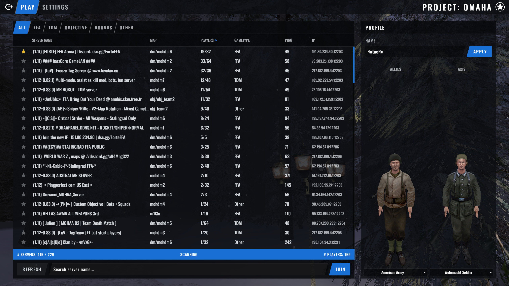
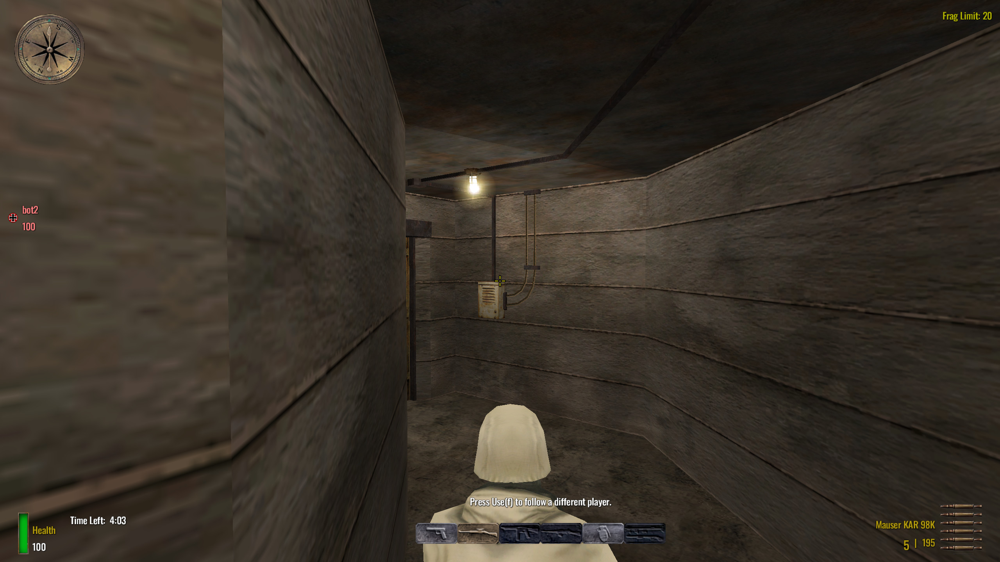
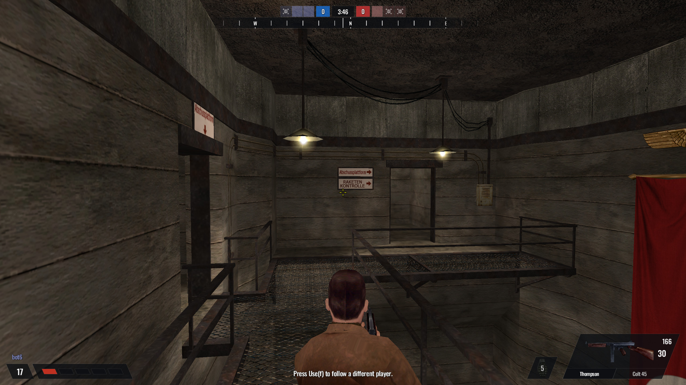
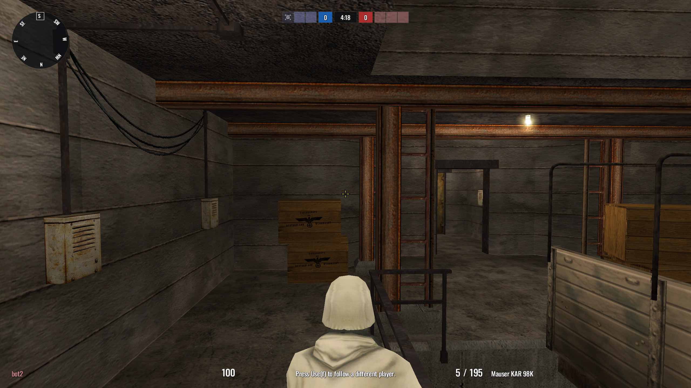
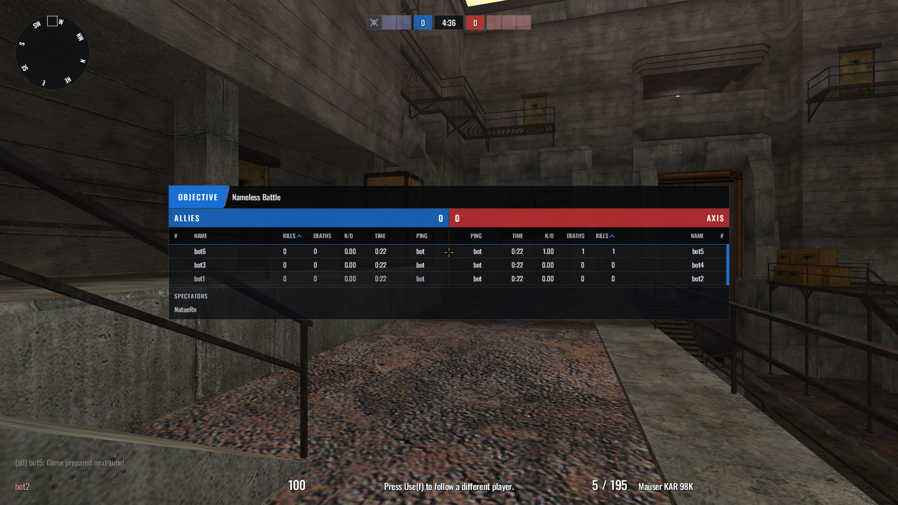
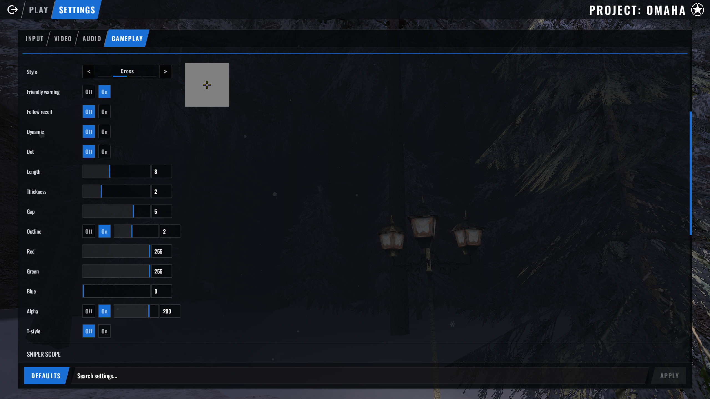

# Project: Omaha

**Project: Omaha** is an independent, **multiplayer-first**, **client-focused** fork of
[OpenMoHAA](https://github.com/openmoh/openmohaa) for *Medal of Honor: Allied Assault*. It targets **quality-of-life** play on
**stock / retail servers**: a new declarative UI stack, swappable HUD packs, and
client-side convenience—without requiring a custom `game.so`.



Not affiliated with or endorsed by the OpenMoHAA team or Electronic Arts.
Binaries and config paths may still use `openmohaa` for install compatibility.

The modern UI is built and tested first for **base Allied Assault** multiplayer.
**Spearhead** and **Breakthrough** support in that stack is **not complete yet**,
but is planned—expansions still run through the OpenMoHAA/legacy paths today.

## Highlights

- **Modern UI engine** — retained-mode XML UI (`uidesign` / `uirender`) with a
  linear flex layout engine, batched GPU drawing, and compositing of world and
  model views into the UI layer. More: [`docs/modern-ui/`](docs/modern-ui/README.md).
- **Player prediction** — accurately shows other players up to about 100–120 ms ahead
  so higher-ping players don’t have to lead shots as much. Modes: **Off**,
  **Safe** (steadier motion, little lag help), **Lead** (full prediction).
  Defaults to Safe. More:
  [Player prediction](docs/markdown/02-running/05-player-prediction.md).
- **HUD packs** — switch between Classic, Modern, or Competitive in settings,
  or drop in your own pack (mods can ship custom HUDs the same way).
- **Dynamic crosshairs** — shape, size, gap, color, and outline in settings;
  optional dynamic mode that opens with spread and can follow recoil so the
  reticle stays honest while you shoot.
- **In-game overlay** — scoreboard, kill feed, pause menu, weapons and
  grenades on screen, plus living/dead teammate cues on the Competitive pack.
- **Client QoL** — faster internet server discovery, client-only first-person
  chase spectate, and related presentation fixes—all stock-server compatible.

| Classic | Modern | Competitive |
|:---:|:---:|:---:|
|  |  |  |





## Getting started

Install and run like OpenMoHAA (you still need the original game data):

- [Installing](docs/markdown/01-intro/01-installation.md)
- [Running](docs/markdown/02-running/01-running.md)
- [FAQ](docs/markdown/02-running/03-faq.md)
- [Player prediction](docs/markdown/02-running/05-player-prediction.md)
- [Building from source](docs/markdown/04-coding/01-compiling.md)

Primary targets: `openmohaa` (client) and `omohaaded` (dedicated).

**Multiplayer is the focus.** The modern menu and HUD packs are built for online
play. For **single player** (campaign / co-op style retail menus), launch with
legacy UI:

```bash
openmohaa +set ui_legacy 1
```

That restores the stock UIFAKK menus and HUD path. Leave `ui_legacy` at `0`
(the default) for Project: Omaha’s modern multiplayer UI.

## Contributing

See [`CONTRIBUTING.md`](CONTRIBUTING.md). AI-assisted work is allowed **here**.
Do not submit Omaha work to official OpenMoHAA under their generative-AI ban.

Modern UI overview: [`docs/modern-ui/`](docs/modern-ui/README.md).
Implementer contracts: [`designformat.md`](docs/LLM-helpers/designformat.md),
[`ui-rendering-pipeline.md`](docs/LLM-helpers/ui-rendering-pipeline.md).

## License

**GPL-2 or later** — see [`COPYING.txt`](COPYING.txt). Third-party licenses live
under `code/thirdparty/`. Keep `COPYING.txt` with redistributed binaries;
binary recipients are entitled to corresponding source (this repo or a written offer).

## Foundation

Built on the OpenMoHAA / [ioquake3](https://github.com/ioquake/ioq3) /
[F.A.K.K.](https://code.idtech.space/ritual/fakk2-sdk) GPL foundations.
Game preservation and the engine port this fork starts from are the work of
those projects; Project: Omaha is a separate effort on top.
