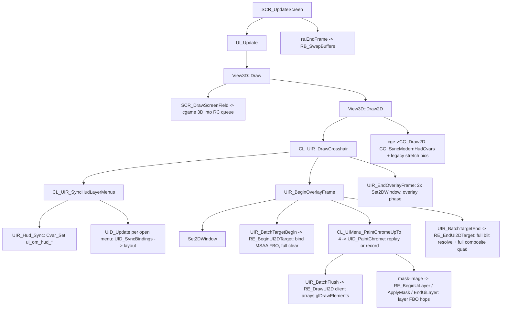

# Modern UI performance program — shared rules, protocol, registry

This folder holds the phase sub-plans for bringing the modern UI (HUD) to
**>= 1000 FPS in a live match** on the reference machine
(Ryzen 9800X3D, 32 GB DDR5-6000, RTX 4070 Ti, 2560x1440, Windows, NVIDIA driver),
where `ui_legacy 1` already holds 1000 FPS.

Read this file before executing any phase file. Every phase file assumes these rules.

## 1. Ground rules (apply to every phase)

1. **Do not touch design/XML.** Nothing under `assets/main/ui/modern/**` is edited by this
   program. `mask-image`, shapes, fonts, fades, compass/kill-feed/scoreboard behaviour stay
   exactly as authored. Optimizations must be output-identical unless a phase explicitly says
   otherwise and the user signs it off.
2. **Do not change existing render defaults.** `r_uiMultisample` stays `"8"`,
   `r_uiFramebuffer` stays `"1"`, `ui_paint_list` stays `"1"`, `ui_shape_clip` stays `"0"`,
   `ui_chrome_cache` stays `"0"`. Never migrate/force-set archived cvars.
3. **Every optimization ships behind a cvar** (listed in section 5), defaulting to the NEW
   behaviour, with the OLD path intact until the phase is signed off. The user must be able
   to A/B in-game with a single `set <cvar> 0/1`. Old paths are removed only in Phase 5.
4. **No file I/O, no per-frame `Com_Printf`, no `glFinish`, no `glGet*` for profiling.**
   All measurement is via in-memory counters shown on-screen (Phase 0). Earlier debug work in
   this codebase proved that per-frame logging invents the very FPS cliffs being hunted.
5. **Renderer changes are GL1 only** (`code/renderergl1/`). `renderergl2` has no modern UI
   hooks (all `RE_UI2D*` / layer hooks are NULL there) — do not add any.
6. **Keep Linux building.** No Windows-only APIs. CPU timing uses `std::chrono::steady_clock`
   in C++ files; in C files count events only (no timing) or use `ri.Milliseconds` if
   millisecond granularity is acceptable (it usually is not — prefer counters).
7. **Build + deploy after every code change:** run `e:\Dev\Omaha\omaha-private\_build_deploy.bat`
   (MSVC + ninja, copies `openmohaa.exe`, `renderer_opengl1.dll`, cgame/game DLLs to
   `e:\Dev\Omaha\test build\`). A phase is not "done" until it is built, deployed and the
   user has run the measurement protocol (section 3).
8. **One phase at a time, in order, with a gate** (section 4). Do not start Phase N+1 before
   Phase N results are recorded in that phase file's "Results" table.
9. Comment convention for new engine code: `/* Added in Omaha: ... */` or
   `/* Changed in Omaha: ... */` (matches the codebase).
10. Do not remove or "clean up" unrelated code while in a phase. Scope creep is the main
    way lower-tier agents break this codebase.

## 2. Pipeline map (what runs every HUD frame today)



Facts verified in code (Sept 2026):

- The UI draws with **immediate qgl calls from the front end** after
  `R_IssuePendingRenderCommands()` drains the RC queue (no SMP thread). `R_IssuePendingRenderCommands`
  is cheap when the queue is empty (it is, during UI drawing).
- Per HUD frame the renderer issues **synchronous GL queries**:
  `qglIsEnabled(GL_SCISSOR_TEST)` + `qglGetIntegerv(GL_SCISSOR_BOX)` in `RE_BeginUiLayer`
  (`tr_ui_layer.c:161-162`) for every soft `mask-image` (compass body always; damage pip when
  visible), `qglIsEnabled(GL_MULTISAMPLE)` in `DrawBox` (`tr_draw.c:396`, used by fades and
  stencil box masks) and in `RE_UI2DBatchBegin`/`RE_DrawUI2D_Inner` when the UI FBO is inactive
  or `r_uiMultisample` is 0 (`tr_ui_batch.c:74,147`). On the Windows NVIDIA driver with
  "Threaded Optimization" (default Auto/On) each such query is a full round-trip stall of the
  driver worker thread; on Linux the NVIDIA driver does not thread by default. This is the
  leading hypothesis for "Linux spotless, Windows not" and is tested first (Phase 0/1).
- UI FBO: `RE_BeginUI2DTarget` clears COLOR|DEPTH|STENCIL full-screen at 8x MSAA;
  `RE_EndUI2DTarget` blits the **whole** 2560x1440 MSAA target to the resolve texture and draws a
  **full-screen** immediate-mode composite quad, even though the HUD covers a fraction of the
  screen. Soft-mask layers use a full-res RT with scissored clear/composite and 3 FBO hops each.
- `UIR_EndOverlayFrame` calls `uir_restore_fullscreen_2d()` twice (2x `Set2DWindow` + scissor)
  even when no model previews are queued.
- Paint list replay (`UID_PaintListTryReplay`) uses `UIR_ForceClipRect`, which defeats clip
  dedup: every recorded CLIP command forces a batch flush + `glScissor`.
- The paint list is **per document**: any PAINT dirt anywhere (kill-feed fade step, timer text,
  health digit) drops the whole HUD's retained list; the next clean frame re-paints and re-records
  all ~180 nodes. Kill-feed/chat fades are quantized to 32 steps, so with anything fading the list
  is invalidated ~20 times per second per fading row.
- `UID_SyncBindings` does three full tree walks per frame (visibility prepass x2 + bind walk),
  each doing string-keyed property lookups per node, even when nothing changed.

## 3. Measurement protocol (used by every phase gate)

Prerequisite: Phase 0 overlay (`ui_perf_hud`) exists.

1. Build + deploy. Launch from `e:\Dev\Omaha\test build\`.
2. Load the agreed benchmark scene: same map, same spawn spot, bots or a real match so the
   kill feed and scores move. Note map name and spot in the phase Results table.
3. `set ui_perf_hud 1`. Wait 3 s (overlay shows 1-second window averages).
4. Record three 10-second readings for each scenario and write the median:
   - **Still**: standing still, not moving the mouse.
   - **Look**: continuously turning (compass tape scrolling).
   - **Busy**: kill feed with 3+ fading rows, scoreboard hold (TAB) for 3 s during the window.
5. Record for both HUDs: modern (`ui_legacy 0`) and legacy (restart with `+set ui_legacy 1`,
   `ui_legacy` is `CVAR_INIT`).
6. For each new cvar of the phase, record with the cvar at new value and at old value.
7. Fill the phase file's Results table. Numbers are microseconds from the overlay, not FPS
   (FPS is capped/noisy near 1000).

Columns to record: `frame us`, `ui total us`, `sync us`, `bind us`, `layout us`, `paint us`,
`replay hit %`, `cg2d us`, `draws`, `scissor`, `fbo binds`, `gl gets`, `set2d`, `gpu ui us`
(when `ui_perf_gpu 1`).

Targets at the end of the program (modern, Busy scenario): `frame us <= 1000`,
`ui total us <= 150`, `gl gets = 0`, `draws <= 25`, `fbo binds <= 4`, `replay hit % >= 95`.

## 4. Phase order and gates

| Phase | File | Gate to proceed |
|-------|------|-----------------|
| 0 | `phase-0-instrumentation.md` | Overlay works, baseline table filled, driver diagnostics done |
| 1 | `phase-1-gl-sync-removal.md` | `gl gets = 0` in all scenarios; results recorded; user sign-off |
| 2 | `phase-2-fbo-traffic.md` | Pixel-identical screenshots; `gpu ui us` reduced; sign-off |
| 3 | `phase-3-draw-call-reduction.md` | `draws` and `scissor` reduced; no visual regressions; sign-off |
| 4 | `phase-4-hud-caching.md` | `replay hit % >= 95` in Busy; `paint us`, `bind us` targets; sign-off |
| 5 | `phase-5-cleanup.md` | Old paths removed for approved items; docs updated |

Decision rule after Phase 1: if `frame us` for modern is already within 5% of legacy in all
three scenarios, Phases 2-3 become optional (still recommended for headroom) and Phase 4 is
executed only for the items whose counters are still above target.

## 5. Cvar registry (new knobs introduced by this program)

| Cvar | Phase | Default | Meaning |
|------|-------|---------|---------|
| `ui_perf_hud` | 0 | 0 | 0 off, 1 summary overlay, 2 verbose |
| `ui_perf_gpu` | 0 | 0 | GPU timer queries (adds one sync every 60 frames; see Phase 0) |
| `r_uiSyncQueries` | 1 | 0 | 1 restores old `glIsEnabled`/`glGetIntegerv` paths (A/B only) |
| `ui_d2d_dedup` | 1 | 1 | Skip redundant `Set2DWindow`/scissor in the compositor |
| `r_uiClearMode` | 2 | 0 | 0 color-only UI FBO clear, 1 old color+depth+stencil |
| `r_uiResolveRects` | 2 | 1 | Region-limited MSAA resolve + composite (0 = full screen) |
| `ui_replay_clip_dedup` | 3 | 1 | Paint-list replay respects applied-clip dedup |
| `r_uiVbo` | 3 | 1 | Stream UI batches through a VBO ring instead of client arrays |
| `ui_batch_softclip` | 3 | 0 | Geometric clipping instead of `glScissor` (needs visual sign-off) |
| `ui_paint_regions` | 4 | 1 | Per-region retained paint chunks |
| `ui_live_translate_cache` | 4 | 1 | Cached verts + offset for bound translate subtrees |
| `ui_live_opacity_cache` | 4 | 1 | Cached verts + alpha scale for foreach lifetime fades |
| `ui_bind_deps` | 4 | 1 | Cvar dependency index instead of full bind walks |
| `ui_bind_deps_verify` | 4 | 0 | Debug: run full walk after targeted sync and report divergence |
| `cg_hud_push_cache` | 4 | 1 | cgame skips unchanged `ui_om_hud_*` string pushes |

Register cvars where their siblings live: `CL_UIR_RegisterCvars` in
`code/client/cl_uirender.cpp` (~line 6000) for `ui_*`, `R_Register` in
`code/renderergl1/tr_init.c` (~line 1567) for `r_ui*`, `CG_RegisterCvars` in cgame for `cg_*`.
All new cvars are `CVAR_ARCHIVE` except `ui_perf_*` and `ui_bind_deps_verify` (`CVAR_TEMP`).

## 6. Sign-off template (copy into each phase's Results section)

```
Build: <date/time of _build_deploy>   Map/spot: <...>
Scenario | HUD    | cvar state | frame us | ui total | sync | bind | layout | paint | hit% | cg2d | draws | scissor | fbo | gets | set2d | gpu ui
Still    | modern | new        |
Still    | modern | old        |
Still    | legacy | -          |
Look     | ...
Busy     | ...
User verdict: approved / rejected (reason)
```
